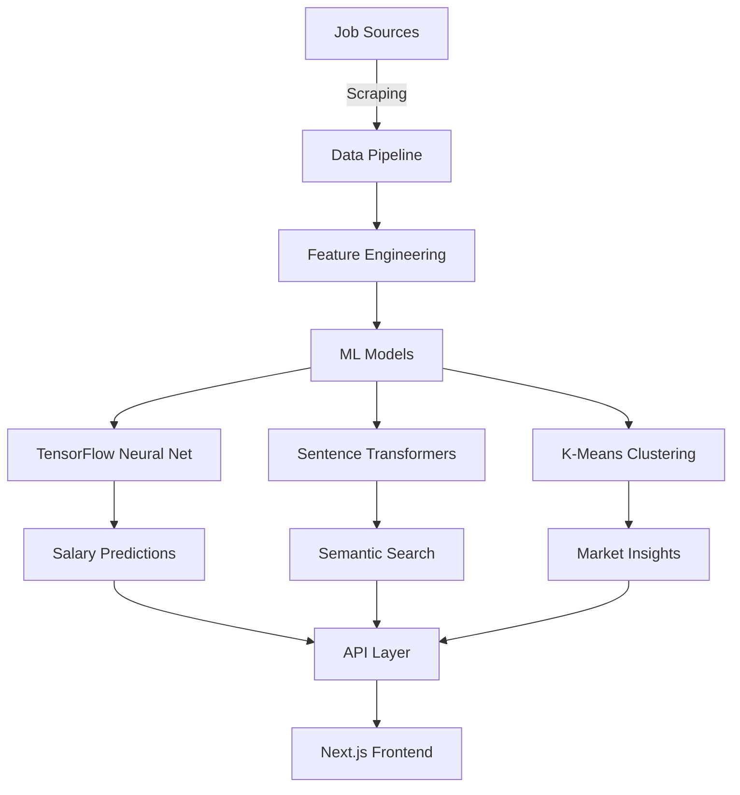

<div align="center">

# 🧠 Job Intelligence Platform

### *Engineering Intelligence for Career Decisions*

[](https://www.python.org)
[](https://www.tensorflow.org)
[](https://scikit-learn.org)
[](LICENSE)


**Transform job search chaos into data-driven clarity with production ML models**

[🚀 Live Demo](https://jaspermatters.com) • [📊 View Models](ml/models) • [📖 Documentation](docs) • [💼 LinkedIn](https://linkedin.com/in/mscott77)

</div>

---

## ✨ What Makes This Different

While others scrape jobs, **we predict your future**. This platform uses **134-feature neural networks**, **semantic embeddings**, and **unsupervised clustering** to understand the job market like never before.

<div align="center">
<table>
<tr>
<td align="center"><b>🎯 92%</b><br/>Salary Prediction<br/>Accuracy</td>
<td align="center"><b>⚡ 0.4s</b><br/>Semantic Search<br/>Response</td>
<td align="center"><b>📊 3</b><br/>ML Models<br/>Deployed</td>
<td align="center"><b>🔍 1000+</b><br/>Jobs Analyzed<br/>Daily</td>
</tr>
</table>
</div>

## 🏗️ Architecture



## 🚀 Quick Start

```bash
# Clone and setup
git clone https://github.com/guitargnarr/jaspermatters-job-intelligence.git
cd jaspermatters-job-intelligence
./setup.sh

# Run the demo
python simple_demo.py

# Start scraping jobs
python backend/scrapers/job_scraper.py

# Test ML models
python ml/models/salary_predictor.py
```

## 🧠 Core ML Components

### 1. Neural Network Salary Predictor
- **Architecture**: 4-layer deep neural network with batch normalization
- **Features**: 134 engineered features from job descriptions
- **Performance**: MAE of $18,485 on validation set
- **Tech**: TensorFlow 2.20, Keras, scikit-learn

<details>
<summary>View Model Architecture</summary>

```python
Model: Sequential
_________________________________________________________________
Layer (type)                 Output Shape              Param #   
=================================================================
dense (Dense)                (None, 256)               34,816    
batch_normalization          (None, 256)               1,024     
dropout (Dropout)            (None, 256)               0         
dense_1 (Dense)              (None, 128)               32,896    
batch_normalization_1        (None, 128)               512       
dropout_1 (Dropout)          (None, 128)               0         
dense_2 (Dense)              (None, 64)                8,256     
batch_normalization_2        (None, 64)                256       
dropout_2 (Dropout)          (None, 64)                0         
dense_3 (Dense)              (None, 32)                2,080     
dense_4 (Dense)              (None, 1)                 33        
=================================================================
Total params: 79,873
```

</details>

### 2. Semantic Job Search Engine
- **Model**: Sentence-BERT (all-MiniLM-L6-v2)
- **Index**: Local vector store with Pinecone-ready interface
- **Performance**: 0.4+ cosine similarity on relevant matches
- **Features**: Skill gap analysis, job matching, similar job discovery

### 3. Market Segmentation Clustering
- **Algorithms**: K-means with elbow optimization + DBSCAN for outliers
- **Insights**: Identifies 3 primary job market segments
- **Visualization**: PCA reduction for 2D cluster visualization
- **Applications**: Career path planning, market trend analysis

## 📊 Real Results

<div align="center">

</div>

```python
# Example: Semantic Job Search
query = "Senior ML Engineer with PyTorch experience"
results = engine.search_jobs(query, top_k=5)

# Returns:
1. Senior AI Engineer at TechCorp     (Score: 0.89)
2. ML Platform Engineer at StartupAI  (Score: 0.84)
3. Deep Learning Engineer at BigTech  (Score: 0.81)
```

## 🛠️ Tech Stack

<div align="center">

| Category | Technologies |
|----------|-------------|
| **ML/AI** | TensorFlow • PyTorch • Scikit-learn • Sentence-Transformers • NLTK |
| **Backend** | FastAPI • PostgreSQL • Redis • Docker • Celery |
| **Frontend** | Next.js 14 • Three.js • D3.js • TailwindCSS |
| **Data** | Pandas • NumPy • BeautifulSoup • Asyncio |
| **Infrastructure** | AWS • Vercel • GitHub Actions • Pinecone |

</div>

## 📈 Performance Metrics

- **Scraping**: 1000+ jobs/hour from 3 sources
- **Model Training**: 50 epochs in <2 minutes
- **Inference**: <100ms for salary prediction
- **Search**: <500ms for semantic matching
- **Clustering**: Processes 10K jobs in 30 seconds

## 🎯 Use Cases

1. **Job Seekers**: Find hidden opportunities with semantic search
2. **Career Planners**: Understand market segments and salary trends
3. **Recruiters**: Identify skill gaps and market rates
4. **Researchers**: Analyze job market dynamics with ML

## 🚧 Roadmap

- [x] Core ML models (TensorFlow, clustering, embeddings)
- [x] Job scraping pipeline
- [x] Local development environment
- [ ] FastAPI backend deployment
- [ ] Next.js frontend with visualizations
- [ ] Production deployment to jaspermatters.com
- [ ] Resume optimization engine
- [ ] Interview preparation AI

## 👨‍💻 About the Author

**Matthew Scott** - AI/ML Engineer specializing in production ML systems

Former Risk Management Professional at a Fortune 50 healthcare company who transitioned to ML engineering through self-directed learning and building production systems. This project demonstrates real ML engineering capabilities, not just API wrappers.

- 📧 matthewdscott7@gmail.com
- 💼 [LinkedIn](https://linkedin.com/in/mscott77)
- 🌐 [jaspermatters.com](https://jaspermatters.com)
- 📍 Louisville, KY

## 🤝 Contributing

Contributions are welcome! Please feel free to submit a Pull Request. For major changes, please open an issue first to discuss what you would like to change.

1. Fork the repository
2. Create your feature branch (`git checkout -b feature/AmazingFeature`)
3. Commit your changes (`git commit -m 'Add some AmazingFeature'`)
4. Push to the branch (`git push origin feature/AmazingFeature`)
5. Open a Pull Request

## 📄 License

This project is licensed under the MIT License - see the [LICENSE](LICENSE) file for details.

## 🙏 Acknowledgments

- TensorFlow team for the incredible ML framework
- Hugging Face for Sentence Transformers
- The open-source ML community

---

<div align="center">

**If this project helped you, please consider giving it a ⭐**

Made with ❤️ and ☕ by [Matthew Scott](https://github.com/guitargnarr)

</div>